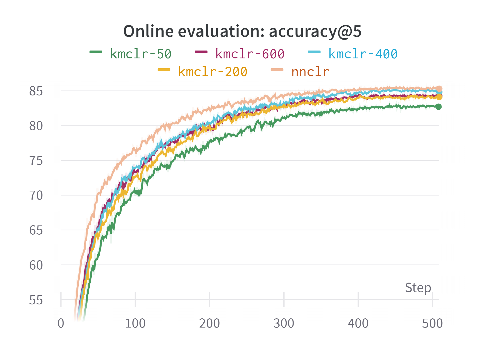
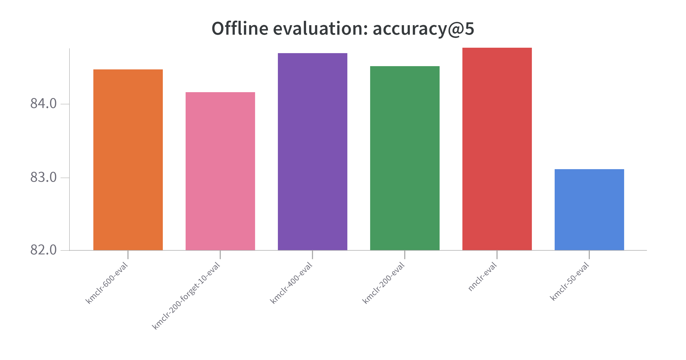

# Beyond Single Instance Positives For Contrastive Visual Representation Learning
<p align="center">  </p> <br>

Humans subconsciously compare new sensory inputs with something they have already experienced and this might play an important role in how they can rapidly acquire new concepts. For instance. if we are asked to picture a <i>mangalitsa pig</i>, even without having seen one before, our brain will automatically link it with other similar semantic classes like <i>pig</i> or <i>boar</i>. NNCLR show that enhancing self-supervised techniques with the ability to find similarities between new and previously seen items can improve their representation learning capabilities.

Indeed, other instance discrimination approaches like SimCLR or BYOL focus on learning what makes a specific image different from everything else in the dataset. They typically generate multiple views of each image through data augmentation, consider them as positive samples, and then encourage their representations to be close in the embedding space. These single-instance positives may however not be able to capture all the variance inside a given class and, what's more important, they can't account for similarities between semantically close classes. NNCLR instead uses as a positive sample the nearest neighbor of an image's view in the embedding space. In practice this requires a large support set of previous embeddings that is updated on a per-batch basis; in principle, the bigger the suppost set the better the results. We argue that this brings their solution closer to a brute force approach and strive to find an alternative.

In particular, we propose to generate prototype vectors via online clustering and then use as the positive sample for an image the code that's nearer to its embedding. We speculate that this will be able to effectively capture both intra-class variances and similarities between multiple classes, while limiting the number of vectors we have to store. Due to computational and timing constraints, all our experiments use the CIFAR-100 dataset for pre-training and only run for 500 epochs with 10 epochs of warmup followed by cosine decay. As we show in the figure below, our KMCLR approach with k = 400, achieves performances on par with NNCLR while storing only 0.4\% the number of vectors and not increasing the running time.

<p align="center">
  
</p>

Note that all our experiments were tracked with Weigths & Biases and can be publicly accessed [here](https://wandb.ai/mwritescode/nnclr-cifar100).

## Requirements

The code has been tested with Python 3.10.6. <br>
In order to install the required python packages it's recommended to (i) create a virtual environment, (ii) install `torch` and `torchvision` following the [official instructions](https://pytorch.org/), and (iii) simply run the below script to install the remaining requirements.
```sh
  pip install -U pip
  pip install -r requirements.txt
```

## Usage
In order to pre-train and linearly evaluate a model you can run
```sh
 python pretrain.py path/to/your/config_file.yaml # for training
 python linear_eval.py path/to/your/config_file.yaml # for evaluation
```
where `config_file.yaml` is a YACS configuration file following those in the [config folder](src/config/). Note that, if during training or evaluation you want to use wandb to log your metrics you also need to run `wandb login` before the commands above in order to login to your account.
